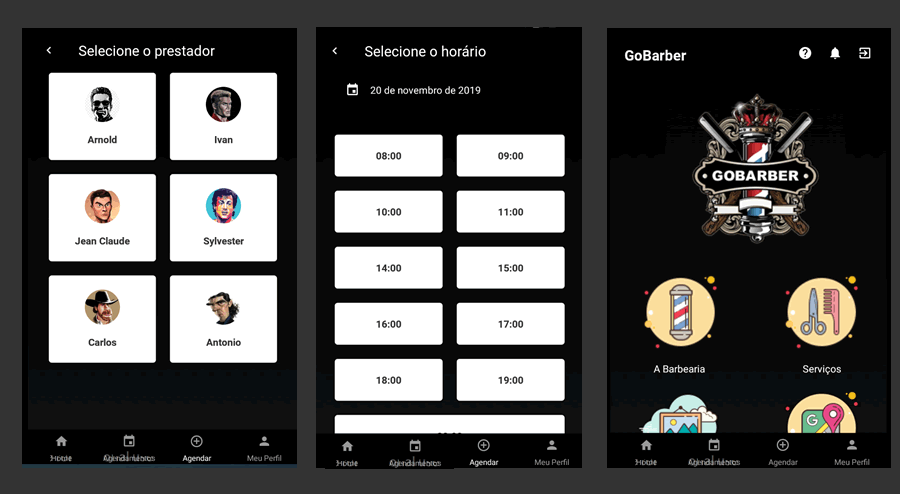

# APLICATIVO GO BARBER

Nesse desafio foi construida uma aplicação completa envolvendo back-end com NodeJS e mobile com React Native.

A aplicação consiste em um app de agendamento de serviços de barbearia.

O link para o backend deste aplicativo se encontra aqui:

https://github.com/dbins/rocketseat_gobarber_api.git

Neste aplicativo foi utilizado o React Native CLI, estilização através de Styled Components, React Navigation, Redux, Redux Saga e Reactotron. Também foi feita uma splashscreen e um ícone personalizado.

## Instalação

- git clone https://github.com/dbins/rocketseat_gobarber_mobile.git
- npm install
- Ative o backend junto com a fila de disparos de e-mails (Redis)
- Edite o arquivo /src/services/api.js e insira o endereço de IP da API
- Edite o arquivo /src/config/ReactotronConfig.js e informe o seu IP local. Essa etapa é opcional, é apenas para quem for testar a aplicação usando o Reactotron.
- Abra o emulador. Os testes foram feitos no Windows 10 utilizando o emulador Genymotion (Android)
- react-native run-android

## Requisitos Funcionais

**Usuário/Autenticação**

- O usuário pode se cadastrar com nome, e-mail e senha;
- O usuário pode realizar login utilizando e-mail e senha;

**Detalhes**

- A tela inicial do aplicativo deve listar os agendamentos, com opção de cancelar até 2 horas antes.
- Deve existir uma lista de prestadores de serviços. Ao selecionar um deles, deve ser possível marcar um serviço.
- Deve ser possível marcar um ou mais agendamentos futuros, desde que não seja no final de semana.
- O backend deve enviar um e-mail para o prestador de serviço avisando que foi marcado um serviço.

